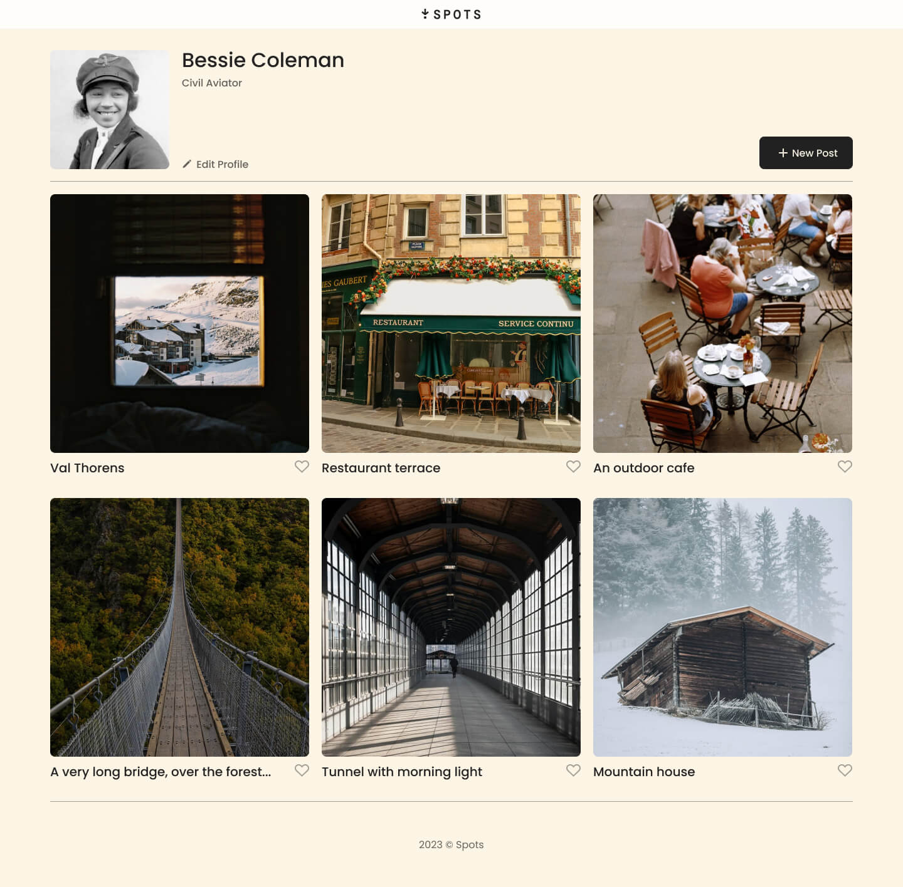
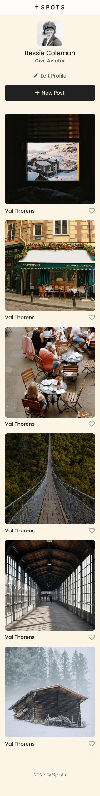
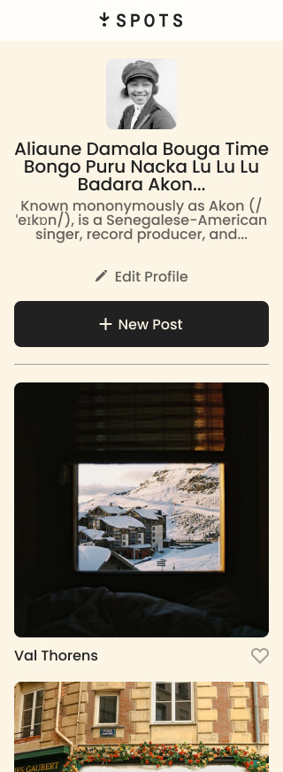

# Project 3: Spots

### Overview

- Intro
- Figma
- Images

**Intro**

This project is made so all the elements are displayed correctly on popular screen sizes. In order to accomplish this, I needed to use flexbox, grid, and media queries. External fonts were also used so those had to be implemented using CSS. This is a social media inspired website with a profile, images, descriptions, and buttons. The website is designed so it works seemlessly on computers, tablets, and mobile devices.

**Figma**

- [Link to the project on Figma](https://www.figma.com/file/BBNm2bC3lj8QQMHlnqRsga/Sprint-3-Project-%E2%80%94-Spots?type=design&node-id=2%3A60&mode=design&t=afgNFybdorZO6cQo-1)

**Images**

**My Project**
[Link to my project](https://elvin-lucero.github.io/se_project_spots/)
